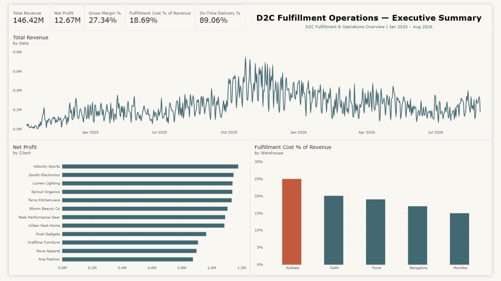
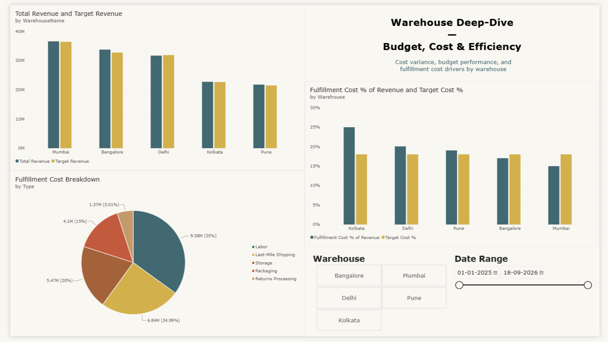

# D2C Fulfillment Operations Dashboard — Power BI

A Power BI portfolio project analyzing revenue, profitability, warehouse efficiency, budget performance, fulfillment costs, and delivery SLA compliance for a fictional D2C business.

All data in this project is synthetic and was generated specifically for portfolio and learning purposes. It does not represent the performance or operations of a real company.

## Business Objective

The goal was to build an executive-facing BI solution connecting overall financial performance with warehouse-level operational drivers. The dashboard answers:

- How are revenue and profitability performing?
- Which warehouses are driving fulfillment-cost pressure?
- How are warehouses performing against revenue and cost targets?
- Which fulfillment cost categories contribute most to total cost?
- How effectively are customer delivery commitments being met?

## Dashboard

### Executive Summary



High-level view of Total Revenue, Net Profit, Gross Margin %, Fulfillment Cost % of Revenue, On-Time Delivery %, revenue trend, client-level profitability, and warehouse fulfillment-cost efficiency.

### Warehouse Deep-Dive



Warehouse-level analysis of Actual vs. Target Revenue, Fulfillment Cost % vs. Target, fulfillment cost breakdown by type, and interactive warehouse/date filtering.

## Key Findings

- Total revenue: ₹146.42M
- Gross margin: 27.34%
- Net profit: ₹12.67M
- Fulfillment cost: 18.69% of revenue
- Overall on-time delivery: 89.06%
- Kolkata has the highest fulfillment cost at approximately 25%, against an 18% target
- Mumbai and Bangalore operate below the fulfillment-cost target

## Data Model

Star schema with shared dimensions and multiple fact tables.

**Dimensions**
- Dim_Date
- Dim_Client
- Dim_SKU
- Dim_Warehouse
- Dim_CostType

**Fact Tables**
- Fact_Orders — order-level transactional data
- Fact_Order_Costs — order-level cost allocation by cost type
- Fact_Inventory_Snapshot — weekly SKU/warehouse inventory snapshots
- Budget — monthly warehouse revenue and cost targets

## DAX

Key measures include:

- Total Revenue
- Total COGS
- Gross Profit
- Gross Margin %
- Net Profit
- Fulfillment Cost % of Revenue
- Cost Variance vs Target
- Revenue vs Budget %
- Revenue YTD
- Revenue LY / YoY %
- On-Time Delivery %

## Data Generation

Synthetic data generated using Python with pandas and NumPy, including:

- Seasonal demand patterns
- Weekend demand variation
- Warehouse-specific fulfillment-cost rates
- Client onboarding dates
- SKU-level pricing and margins
- Order, shipping, and delivery dates
- Client-tier delivery SLAs
- Warehouse budgets with controlled variance
- Cost-type allocation with exact reconciliation to fulfillment cost
- Weekly inventory snapshots

Random seeds are used to make the generated dataset reproducible.

## Getting Started

Clone the repository:

```bash
git clone https://github.com/mankindsangel/d2c-fulfillment-powerbi.git
cd d2c-fulfillment-powerbi
```

Install the Python dependencies:

```bash
pip install pandas numpy faker
```

Regenerate the synthetic datasets:

```bash
python Python/generate_data.py
```

Generated CSVs are saved to the `Data/` folder.

Open `PowerBI/D2C_Fulfillment_Operations.pbix` in Power BI Desktop to explore the model and dashboards.

## Tools

Power BI · DAX · Python · pandas · NumPy

## Disclaimer

This project uses entirely synthetic data and does not represent any real company.
